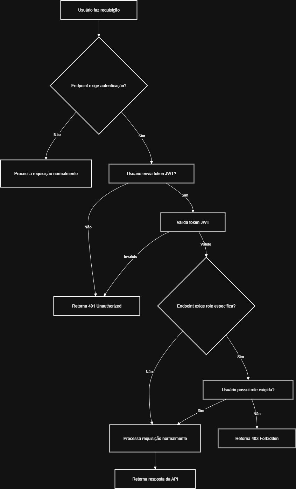

# Minimal API .NET C#

## Visão Geral

Este projeto é uma API REST minimalista desenvolvida em .NET 9 utilizando Minimal API, autenticação JWT e banco de dados MySQL. Ele oferece endpoints para gerenciamento de administradores e veículos, com autenticação e autorização baseada em perfis.

---

## Tecnologias Utilizadas

- **.NET 9 (Minimal API)**
- **C#**
- **MySQL**
- **Entity Framework Core**
- **Autenticação JWT (Json Web Token)**
- **Swagger (Swashbuckle)**
- **Visual Studio Code**

---

## Configuração

### 1. Banco de Dados

No arquivo `appsettings.json`:

```json
"ConnectionStrings": {
  "mySqlConnection": "Server=localhost;Database=minimal_api-test;Uid=root;Pwd=123465*;"
}
```
> Altere o usuário e senha conforme seu ambiente.

### 2. JWT

No arquivo `appsettings.json`:

```json
"Jwt": "minimal-api-key-12345"
```
> Para acessar via `builder.Configuration["Jwt"]`.  
> **Recomendado:** Para produção, use:
```json
"Jwt": {
  "key": "minimal-api-key-12345"
}
```
e acesse via `builder.Configuration["Jwt:key"]`.

---

## Como Executar

1. **Configure o banco de dados**  
   Certifique-se que o MySQL está rodando e o banco `minimal_api-test` existe.

2. **Ajuste o `appsettings.json`**  
   Atualize usuário, senha e chave JWT conforme necessário.

3. **Rode as migrações**  
   ```bash
   dotnet ef database update
   ```

4. **Execute a aplicação**  
   ```bash
   dotnet run
   ```

5. **Acesse o Swagger**  
   [http://localhost:5065/swagger](http://localhost:5065/swagger)

---

## Endpoints Principais

### Autenticação

#### Login

**POST** `/login`

**Body:**
```json
{
  "email": "admin@teste.com",
  "senha": "123456"
}
```
**Resposta:**
```json
{
  "token": "eyJhbGciOiJIUzI1NiIsInR5cCI6IkpXVCJ9..."
}
```

---

### Administradores

#### Criar Administrador

**POST** `/administradores`

**Body:**
```json
{
  "email": "novo@teste.com",
  "senha": "123456",
  "perfil": "adm"
}
```

#### Listar Administradores

**GET** `/administradores`
- **Requer autenticação (role: adm)**

#### Exemplo de requisição autenticada

```bash
curl -X GET "http://localhost:5065/administradores" \
  -H "Authorization: Bearer {token}"
```

---

### Veículos

#### Listar Veículos

**GET** `/veiculos?pagina=1`
- **Requer autenticação (role: adm ou editor)**

#### Criar Veículo

**POST** `/veiculos`

**Body:**
```json
{
  "marca": "Fiat",
  "modelo": "Uno",
  "ano": 2020
}
```
- **Requer autenticação (role: adm ou editor)**

---

## Tabela de Endpoints

| Método | Rota                    | Descrição                        | Autenticação / Role      | Body de Exemplo                                                                 |
|--------|-------------------------|----------------------------------|-------------------------|---------------------------------------------------------------------------------|
| POST   | `/login`                | Autenticação e geração de token  | Não                     | `{ "email": "admin@teste.com", "senha": "123456" }`                             |
| GET    | `/administradores`      | Lista todos administradores      | Sim / adm               | -                                                                               |
| POST   | `/administradores`      | Cria novo administrador          | Sim / adm               | `{ "email": "novo@teste.com", "senha": "123456", "perfil": "adm" }`             |
| GET    | `/veiculos`             | Lista veículos paginados         | Sim / adm, editor       | -                                                                               |
| POST   | `/veiculos`             | Cria novo veículo                | Sim / adm, editor       | `{ "marca": "Fiat", "modelo": "Uno", "ano": 2020 }`                             |
| GET    | `/veiculos/{id}`        | Busca veículo por ID             | Sim / adm, editor       | -                                                                               |
| PUT    | `/veiculos/{id}`        | Atualiza veículo por ID          | Sim / adm, editor       | `{ "marca": "Fiat", "modelo": "Uno", "ano": 2021 }`                             |
| DELETE | `/veiculos/{id}`        | Remove veículo por ID            | Sim / adm               | -                                                                               |-                                                                               |

> **Obs:**  
> - Envie o token JWT no header: `Authorization: Bearer {token}` para endpoints que exigem autenticação.
> - Os perfis aceitos são `"adm"` e `"editor"` conforme o campo `perfil`.

---

## Fluxograma



## Observações

- **Roles/Perfis:** Use `"adm"` ou `"editor"` no campo `perfil` para controle de acesso.
- **Swagger:** Utilize `/swagger` para testar todos os endpoints de forma interativa.
- **Token JWT:** Envie o token no header `Authorization: Bearer {token}` para acessar rotas protegidas.

---
